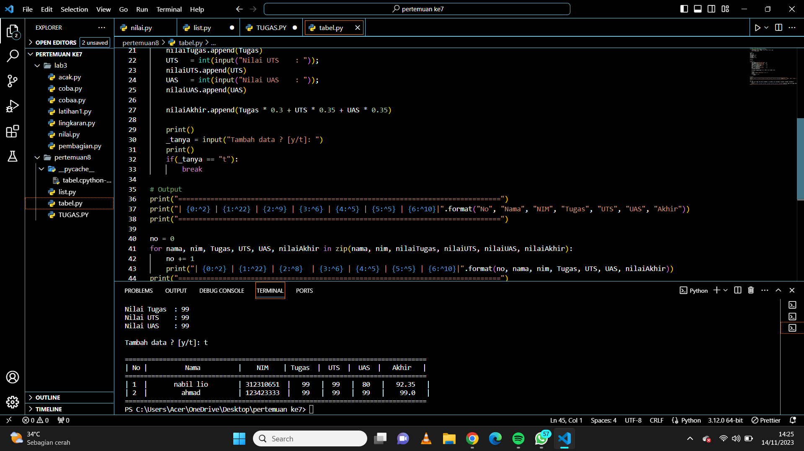

#menginput nilai akhir#
 
def hitung_nilai_akhir(tugas, uts, uas):
nilai_akhir = 0.3 * tugas + 0.35 * uts + 0.35 * uas
return nilai_akhir
   
#membuat list data untuk pemanggilan data nanti#
 
nama = []
nim = []
nilaiTugas = []
nilaiUTS = []
nilaiUAS = []
nilaiAkhir = []
 
 
 
#menginput data menggunakan while true#
 
while True:
nama.append(input("Masukan nama : "))
nim.append(input("Masukan NIM : "))
Tugas = int(input("Nilai Tugas : "));
nilaiTugas.append(Tugas)
UTS = int(input("Nilai UTS : "));
nilaiUTS.append(UTS)
UAS = int(input("Nilai UAS : "));
nilaiUAS.append(UAS)
nilaiAkhir.append(Tugas * 0.3 + UTS * 0.35 + UAS * 0.35)
 
 
 
#perulangan#
 
print()
_tanya = input("Tambah data ? [y/t]: ")
print()
if(_tanya == "t"):
break
 
 
 
#membuat tabel dan memasukan data yg telah diinputkan kedalam tabel#
 
print("================================================================================")
print("| {0:^2} | {1:^22} | {2:^9} | {3:^6} | {4:^5} | {5:^5} | {6:^10}|".format("No", "Nama", "NIM", "Tugas", "UTS", "UAS", "Akhir"))
print("================================================================================")

no = 0
for nama, nim, Tugas, UTS, UAS, nilaiAkhir in zip(nama, nim, nilaiTugas, nilaiUTS, nilaiUAS, nilaiAkhir):
no += 1
print("| {0:^2} | {1:^22} | {2:^8} | {3:^6} | {4:^5} | {5:^5} | {6:^10}|".format(no, nama, nim, Tugas, UTS, UAS, nilaiAkhir))
print("================================================================================") 

